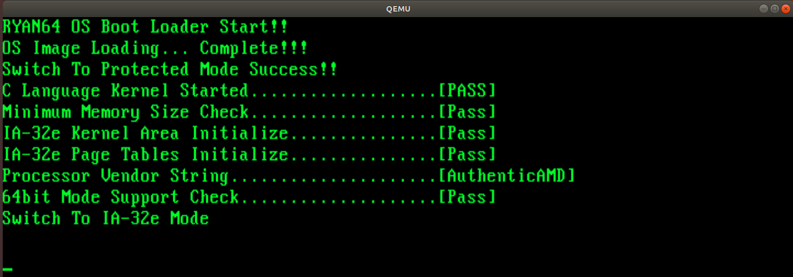
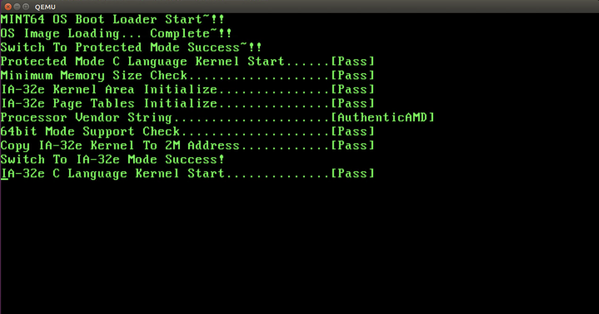

보호 모드에서 IA-32e 모드로 전환하려면 7단계를 거쳐야 한다.

1. 세그먼트 디스크립터 추가
(IA-32e 모드 코드와 데이터용 세그먼트 디스크립터 추가)

2. CR4 컨트롤 레지스터 설정
(CR4 컨트롤 레지스터의 PAE 비트 = 1)

3. CR3 컨트롤 레지스터 설정
(CR3 컨트롤 레지스터에 PML4 테이블 어드레스 설정)

4. IA32_EFER 레지스터 설정
(IA32_EFER 레지스터(MSR 레지스터)의 LME 비트 = 1)

5. CR0 컨트롤 레지스터 설정
(CR0 컨트롤 레지스터의 PG 비트 = 1)

6. jmp 명령으로 CS 세그먼트 셀렉터 변경 및 IA-32e 모드로 전환
(jmp 0x18:IA-32e 모드 커널의 시작 어드레스)

7. 각종 세그먼트 셀렉터와 스택 초기ㅗ하
(DS, ES, FS, GS, SS 세그먼트 셀렉터와 RSP, RBP 레지스터 초기화)


<32비트 보호 모드>
------------------------------------------------------------------
<64비트 IA-32e 모드>

IA-32e 모드 커널 실행


위의 과정은 세 부분으로 나눌 수 있다.
1. 디스크립터와 셀렉터를 갱신하는 부분
2. 페이징을 활성화하는 부분
3. IA-32e 모드로 전환하는 부분.


i386 이상의 프로세서라면 기본으로 보호 모드 지원
IA-32e 모드는 근래에 추가된 프로세서 확장 기능(Processor Extended Feature)
-> 프로세서가 IA_32e 모드 지원하는지 여부 확인


#### 프로세서의 제조사와 IA-32e 지원 여부 검사
- `CPUID 명령어` ->프로세서 제조사 확인  
- IA-32e 모드 지원 확인  

x86계열 프로세서는 프로세서에 대한 정보를 확인할 수 있는 CPUID 명령어를 제공하고 있음
EAX 레지스터에 설정된 값에 따라 정보 조회
범용 레지스터 EAX, EBX, ECX, EDX를 통해 그 결과를 넘겨줌

CPUID는 기본 CPUID 정보(Basic CPUID Information)과 확장 기능 CPUID 정보(Extended Feature CPUID Information)을 제공


우리의 목적은 프로세서가 64비트 모드를 지원하는지 확인하는 것   


제조사와 64비트 지원 기능에 관련된 CPUID 기능 목록으로부터  
0x80000001 으로 확장 기능 CPUID 정보를 조회하면,   
EDX 레지스터의 비트 29로 64비트 지원 여부를 확인할 수 있음   


#### 프로세서 제조사와 IA-32e 모드 지원 여부 확인

__CPUID__
- `EAX` 레지스터에서 조회할 정보를 넘겨받고
- 조회된 정보를 `EAX`, `EBX`, `ECX`, `EDX` 레지스터에 담아 넘겨준다.


우리는 5개의 파라미터로 구성된 kReadCPUID() 함수를 작성하고, C 코드에서  
이를 호출하여 부가 작업을 처리

어셈블리어 코드로 함수를 작성한다고 해서 C 코드에서 호출할 수 있는 것은 아님.  
어셈블리어 코드에서 __해당 함수가 외부에서 사용된다는 것__을 알려야 하며,  
이러한 역할을 하는 것이 `global` 지시어.

어셈블리어 파일 상단에 `global kReadCPUID` 추가
-> 링크 단계에서 kReadCPUID() 함수를 호출하는 부분과 어셈블리어 함수를 서로 연결해줌.


kReadCPUID() 함수의 어셈블리어 코드
```
;Export the name so that it can be used in C file )
global kReadCUPID

SECTION .text

;return CPUID
;PARAM: DWORD dwEAX, DWORD* pdwEAX, *pdwEBX, *pdwECX, *pdwEDX
kReadCPUID:
  push ebp
  mov ebp, esp
  push eax
  push ebx
  push ecx
  push edx
  push esi

  ;;;execute  CPUID command with the value in the EAX register
  mov eax, dword [ebp + 8]  ;parameter 1(dwEAX)
  cpuid

  ;;save the returned value in the parameter
  ;*pwdEAX
  mov esi, dword [ebp + 12]   ;save parameter 2 in the ESI register
  mov dword [esi], eax        ;pdwEBX가 포인터 이므로 포인터가 가리키는 어드레스에
                              ;EAX 레지스터의 값을 저장
  ;pdwEBX
	mov esi, dword[dbp + 16]	;parameter 3
	mov dwrod [esi], ebx

  ;pdwECX
	mov esi, dword[ebp + 20]	;parameter 4
	mov dword [esi], ecx

  ;pdwEDX
	mov esi, dword [ebp + 24] ;parameter 5
	mov dword [esi], edx


	pop esi		;삽입의 역순으로 제거해야 함.
	pop edx
	pop ecx
	pop ebx
	pop eax
	pop ebp
	ret
```


kReadCUPID() 함수 선언
```
void kReadCPUID(DWORD dwEAX, DWORD* pdwEAX, DWORD* pdwEBX, DWORD* pdwECX, DWORD* pdwEDX)
```


제조사 정보
	- `EAX` 레지스터에 `0x00` 을 넣은 후 CPUID를 호출하면   
		`EBX`, `EDX`, `ECX` 레지스터로부터 읽을 수 있다.
	- 제조사 문자열은 하위 바이트에서 상위 바이트 순서로 저장됨
		--> 이를 문자열 버퍼로 그대로 복사하면 하나의 완성된 문자열을 얻을 수 있음.

kReadCPUID() 함수를 사용하여 제조사 문자열을 조합하는 코드
```
DWORD dwEAX, dwEBX, dwECX, dwEDX;
char vcVendorString[13] = {0, };

//reading processor vendor
kReadCPUID(0x00, &dwEAX, &dwEBX, &dwECX, &dwEDX);
*(DWORD*) vcVendorString = dwEBX;
*((DWORD*) vcVendorString + 1) = dwEDX;
*((DWORD*) vcVendorString + 2) = dwECX;

kPrintString(0, 0, vcVendorString);
```


IA-32e 모드 지원 여부
	- `EAX` 레지스터에 `0x80000001`을 넣은 후
	- CPUID 명령어를 호출하면 `EDX` 레지스터의 `비트 29`의 값으로 판단할 수 있음.

kReadCPUID() 함수로 IA-32e 모드 지원 여부를 검사하는 코드
```
DWORD dwEAX, dwEBX, ewECX, dwEDX;

//Confirm 64 bit support
kReadCPUID(0x80000001, &dwEAX, &dwEBX, &dwECX, &dwEDX);
if(dwEDX & (1 << 29)) //check if 29th bit of EDX register is 1
{
	kPrintString(0, 0, "Pass");
}else{
	kPrintString(0, 0, "Fail")l
}
```


### IA-32e 모드용 세그먼트 디스크립터 추가

리얼 모드에서 보호 모드로 전환하려면 `보호 모드용 세그먼트 디스크립터`가 필요했듯이,  
보호 모드에서 IA-32e 모드로 전환하기 위해서도 `IA-32e 모드용 세그먼트 디스크립터`가 필요.  

이미 보호 모드 커널 엔트리 포인트에 GDT를 생성했으므로, 여기에 간단히 추가.
//01.Kernel32/Source/EntryPoint.s


#### 보호 모드 커널 엔트리 포인트에 디스크립터 추가
보호 모드의 세그먼트 디스크립터와의 차이점
	- IA-32e 모드에서는 디스크립터의 기준 주소와 세그먼트 크기에 상관 없이 `64GB 전체 영역`으로 설정된다.  
	- 세그먼트 디스크립터의 L 비트가 IA-32e 서브 모드 중 `호환 모드` 또는 `64비트 모드`를 선택하는 데 사용됨.


IA-32e 모드의 서브 모드 중에서 64비트 모드를 사용할 것이므로  
보호 모드용 세그먼트 디스크립터릴 기반으로 `L 비트` = 1, `D 비트` = 0 으로 설정하면 된다.
//L, D 비트가 모두 1인 경우를 다른 목적으로 예약해두었기 때문에 D=0 으로 설정


IA-32e 모드 커널용 코드와 데이터 세그먼트 디스크립터 코드
```
GDT:
	;You must initialize NULL descriptor to 0
	NULLDescriptor:
		dw 0x0000
		dw 0x0000
		db 0x00
		db 0x00
		db 0x00
		db 0x00

	;Code segment descriptor for IA-32e mode kernel
	IA_32eCODEDESCRIPTOR:
		dw 0xFFFF
		dw 0x0000
		db 0x00
		db 0x9A
		db 0xAF
		db 0x00

	;Data segment descriptor for IA-32e mode kernel
	IA_32eDATADESCRIPTOR:
		dw 0xFFFF
		dw 0x0000
		db 0x00
		db 0x92
		db 0xAF
		db 0x00

	;Code segment descriptor for Protected mode kernel
	CODEDESCRIPTOR:
		dw 0xFFFF
		dw 0x0000
		db 0x00
		db 0x9A
		db 0xCF
		db 0x00

	;Data segment descriptor for Protected mode Kernel
	DATADESCRIPTOR:
		dw 0xFFFF
		dw 0x0000
		db 0x00
		db 0x92
		db 0xCF
		db 0x00
GDTEND:
```  

IA-32e 모드용 세그먼트 디스크립터가 보호 모드용 세그먼트 디스크립터 앞에 있으므로  
__보호 모드로 전환할 때 사용했던 세그먼트 셀렉터의 값을 변경__해 줘야 한다.

이전 장
	- 보호 모드용 세그먼트 디스크립터	: 0x08
	- 보호 모드용 데이터 디스크립터 : 0x10

IA-32e 모드가 추가된 후 (이번장)
	- 보호 모드용 세그먼트 디스크립터 : 0x18
	- 보호 모드용 데이터 디스크립터 : 0x20

__01.Kernel32/Source/EntryPoint.s__ 에서 세그먼트 디스크립터를 참조한 코드 수정
```
[ORG 0x00]
[BITS 16]

SECTION .text

START:
	... 생략 ...
	;make kernel code segment be based on 0x00
	;reset EIP based on 0x00
	;CS segment selector : EIP
	jmp dword 0x18: (PROTECTEDMODE - $$ + 0x10000) ;
			;보호 모드 커널용 코드 세그먼트 디스크립터를 0x18로 이동
			;PROTECTEDMODE 레이블의 절대 어드레스

	[BITS 32]
	PROTECTEDMODE:
		mov ax, 0x20	; move data segment descriptor for protected mode kernel to 0x20
		mov ds, ax
		mov es, ax
		mov fx, ax
		mov gs, ax

		... 생략 ...

		jmp dword 0x18: 0x10200	;move to 0x10200 where C kernel exists and execute C kernel 	
```

### IA-32e 모드 전환과 1차 정리

#### 물리 메모리 확장 기능 활성화와 페이지 테이블 설정

물리 메모리 확장(PAE, Physical Address Extension) 기능은 CR4 레지스터의 PAE 비트(비드5)가 담당   
PAE 비트를 1로 설정해서 물리 메모리 확장 기능을 사용할 수 있음   
프로세서에 페이지 테이블을 설정하려면 `CR3` 레지스터에 `PML4 테이블의 어드레스`를 저장.   


물리 메모리 확장 기능을 활성화하고 페이지 테이블을 설정하는 코드
```
;set PAE bit of CR4 control register to 1
mov eax, CR4
or eax, 0x20
mov cr4, ax

;activate PML4 table address and cache on CR3 control register
mov eax, 0x100000	;write 0x100000(1MB) where PML4 table is located on EAX
mov cr3, eax
```


#### 64비트 모드 활성화와 페이징 활성화

`IA32_EFER` 레지스터의 `LME` 비트를 1로 설정   
IA32_EFER 레지스터의 비트를 활성화 하지 않으면,   
IA-32e 모드용 세그먼트 레지스터로 교체한다 해도 32비트 보호 모드로 동작할 뿐.  

범용 또는 컨트롤 레지스터가 아니며 MSR(Model-Specific Register)라고 불리는 특수한 용도의 레지스터


IA-32e 모드 전환에 사용할 IA32_EFER(Extended Feature Enable Register) 레지스터는  
프로세서 특성과 모드 지원에 속하는 MSR 레지스터로 프로세서의 확장 기능을 제어할 수 있는 레지스터  

MSR 레지스터는 `개별적으로 할당된 레지스터 어드레스`가 있고,   
해당 어드레스를 통해서만 접근 가능   
데이터 이동 명령(mov)로 접근 불가능  
MSR 레지스터용 명령어를 사용해야함  
	- RDMSR(Read From Model Specific Register)  
	- WRMSR(Write To Model Specific Register)  

	우리가 사용할 IA32_EFER 레지스터는 `0xC0000080` 어드레스에 있음  
	IA-32e 모드 활성화 여부는 `비트 8`에 위치하는 `LME`비트와 관계가 있고   
  이 비트를 ₩로 설정하면 IA-32e 모드를 활성화 할 수 있음  


IA32_EFER 레지스터를 통한 IA-32e 모드 활성화
```
mov eax, 0xC0000080
rdmsr

or eax, 0x0100	; LSM (bit 8) = 1
wrmsr
```


#### IA-32e 모드로 전환과 세그먼트 셀렉터 초기화

RC0 레지스터를 변경하여 캐시와 페이징을 활성화하고서 세그먼트 셀렉터를 IA-32e 커널용으로 교체


	CR0 컨트롤 레지스터의 CD 비트를 1로 설정하여 캐시를 비활성화
		-> 페이지 테이블에 있는 PCD 비트와 PWT 비트가 캐시를 사용하게 설정되었다 해도 __무시됨__   


캐시와 페이지 활성화, IA-32e 모드 전환, 세그먼트 셀렉터 초기화를 수행하는 코드
```
;CR0 control register: NW(bit 29) = 0, CD(bit 30) = 0, PG(bit 31) = 1
;-> activate caching and paging.
mov eax, cr0
or eax, 0xE0000000
xor eax, 0x60000000
mov cr0, eax

jmp 0x08:0x200000 :


;Code located at 0x200000(2MB)
[BITS 64]

mov ax, 0x10
mov ds, ax
mov es, ax
mov fs, ax
mov gs, ax

;stack
mov ss, ax
mov rsp, 0x6FFFF8
mov rbp, 0x6FFFF8

... 생략 ...
```


#### 소스코드 1차 정리와 실행

1. 모드 전환과 관련된 어셈블리어 코드 파일 추가   
	CPUID 명령어 및 IA-32e 모드 전환에 관련된 어셈블리어 코드  
		- ModeSwitch.asm     
		- ModeSwitch.h     
		01.Kernel32/Source 디렉터리에 추가   


2. 보호 모드 커널의 엔트리 포인트 파일 수정   
	보호 모드 커널의 엔트리 모드 파일에는 IA-32e 모드 커널용 세그먼트 디스크립터가 추가되어 있음  
	-> 보호 모드 커널용 디스크립터의 위치가 변경되었음.  
		코드 세그먼트 디스크립터는 0x08 -> 0x18   
		데이터 세그먼트 디스크립터는 0x10 -> 0x20 으로 옮겨짐  

	세그먼트 디스크립터의 위치가 변경되면 jmp 시 지정하는 코드 세그먼트 디스크립터와    
	모드 전환 후 설정하는 데이터 세그먼트 디스크립터를 변경해야 함.  

	01.Kernel32/Source/EntryPoint.s 수정


3. 보호 모드 커널의 C언어 엔트리 포인트 파일 수정
	IA-32e 모드 지원 여부를 검사하는 기능과 IA-32e 모드로 전환하는 기능이 추가되었으니  
	보호 모드 커널의 C 언어 엔트리 포인트 함수에서 이를 호출해야 함.  

	문제 : IA-32e 모드 커널이 아직 준비중이므로 IA-32e전환 함수를 호출할 수 없음  
		-> 전환 함수는 코드를 넣어두되 주석 처리  

	01.Kernel32/Source/Main.c 수정  


### 빌드와 실행

</img><br/>


### 10.4 IA-32e 모드용 커널 준비


#### 커널 엔트리 포인트 파일 생성
이전 코드(C->asm)와는 반대로 어셈블리어 함수에서 C 함수를 호출해야함.  
이를 위해서는 해당 함수가 외부에 있다는 것을 알려야 함. -> `extern` 지시어 사용  
Main() 함수를 엔트리 포인트로 사용할 것이므로 엔트리 포인트 파일 상단에  __extern Main__ 과 같이 입력하면 된다.  

02.Kernel64/Source/EntryPoint.s 수정
- C 언어 엔트리 포인트 파일인 Main() 함수를 call 명령을 통해 호출
- call 명령어 아래에서 무한 루프(jmp $)를 수행


IA-32e 모드 커널의 엔트리 포인트 소스 코드(02.Kernel64/Source/EntryPoint.s)
```
[BITS 64]

SECTION .text
extern Main__

;;Code area
START
  mov ax, 0x10  ; data segment descriptor for IA-32e mode kernel
  mov ds, ax
  mov fs, ax
  mov gs, ax

  ;create stack(1MB)
  mov ss, ax
  mov rsp, 0x6FFFF8
  mov rbp, 0x6FFFF8


  call Main ; in C

  jmp $
```


#### C언어 엔트리 포인트 파일 생성
C언어 코드는 보호 모드 / IA-32e 모드 간 차이가 크게 없음.
다만 보호 모드용 C언어 엔트리 포인트 파일은 IA-32e 모드 전환을 위해 여러 함수들을 포함하고 있으므로, `Main()` 함수와 `kPrintString()` 함수만 정리하여 옮김.  

`02.Kernel64/Source/Types.h` 는 보호 모드의 파일과 같으므로, 복사.

IA-32e 모드 커널의 C 언어 엔트리 포인트 파일 소스 코드(02.Kernel64/Source/Main.c)
```
#include "Types.h"

void kPrintString(int iX, int iY, const char* pcString);
void Main(void){
  kPrintString(0, 10, "Switch To IA-32e Mode Success!");
  kPrintString(0, 11, "IA-32e C Language Kernel Start..............[Pass]");
}

void kPrintString(int iX, int iY, const char* pcString){
  CHARACTER* pstScreen = (CARACTER*) 0xB8000;
  int i;

  pstScreen += (iY * 80) + iX;

  for(i = 0; pcString[i] != 0; i++){
    pstScreen[i].bCharactor = pcString[i];
  }
}
```


#### 링크 스크립트 파일 생성
IA-32e 커널 역시 __라이브러리를 사용하지 않도록 빌드__ 해야 함.
0x200000(2MB) 어드레스로 복사되어 실행될 것이므로, 커널 이미지를 생성할 때 이를 고려해야 함.  

IA-32e 모드용 커널을 빌드해야 하므로 __64비트 이미지__ 에 관련된 elf_x86_64.x 파일을 기반으로 함.  
- .text, .data, .bss에 관련된 필수 섹션을 앞쪽으로 이동
- .text 섹션의 시작 어드레스를 0x200000(2MB)로 변경
- 데이터 섹션의 시작을 섹터 단위로 맞추어 정렬. //디버깅 편리


#### makefile 생성
보호 모드 커널과 달리, IA-32e 모드 커널은 커널 엔트리 포인트와 C언어 커널 엔트리 포인트가 개별적으로 빌드되어 합쳐지는 형태가 아님.  
IA-32e 모드 커널의 커널 엔트리 포인트 파일은 오브젝터 파일의 형태로 컴파일 되어 C 언어 커널과 함께 링크됨.  
-> C언어 엔트리 포인트 파일이 아니라 커널 엔트리 포인트 파일이 링크 목록의 가장 앞에 위치하도록 수정.
- 생성되는 이미지의 포맷과 관련된 부분 수정.
    보호모드 커널 : 32비트 -> -m3 나 -f elf32 와 같이 32비트 관련 옵션 사용
    IA-32e 모드 : 64비트 -> `-m64`와 `-f elf64` 옵션으로 변경


### 보호 모드 커널과 IA-32e 모드 커널 통합
- 보호 모드 커널과 IA-32e 모드 커널을 통합하여 하나의 OS 이미지로 통합

#### 최상위 makefile 수정
IA-32e 모드 커널이 추가 -> 최상의 makefile 수정하여 02.Kernel64 디렉터리에서 make를 수행하도록 변경.  
- 빌드 목록에 Kernel64 추가
- Kernel64의 커맨드 목록에 'make -C 02.Kernel64' 추가
- clean 커맨드 목록에 'make -C 02.Kernel64 clean' 추가


<현재 문제점>
- `ImageMaker` 프로그램은 부트 로더 이미지 파일과 보호 모드 커널 이미지 파일, 두 가지만 결합할 수 있음.  
- IA-32e 모드 커널을 0x200000(2MB) 어드레스의 위치로 복사하려면 IA-32e 모드 커널에 대한 위치 정보 필요  

<해결>
- ImageMaker 프로그램을 수정하여 IA-32e 모드 커널 파일을 입력으로 받아들이게 하고,  
커널의 총 섹터 수 외에 __보호 모드 커널의 섹터 수__ 를 추가로 기록하도록 수정
- 보호 모드 커널은 부트 로더나 보호 모드 이미지에 기록된 정보를 이용하여 IA-32e 모드 커널을 0x200000 영역으로 이동시킴.  


#### 부트 로더 파일 수정
ImageMaker 프로그램 수정 전 먼저 `부트 로더`를 수정하여, 보호 모드 커널의 섹터 수를 위한 공간 할당.   
부트 로더 영역에는 2바이트 크기의 `TOTALSECTORCOUNT`가 있으며,   
ImageMaker 프로그램은 이 영역에 부트 로더를 제외한 나머지 영역의 섹터 수를 기록.  
부트 로더의 __TOTALSECTORCOUNT 영역 이후에 2바이트를 할당__ 하여 보호 모드 커널 섹터 수를 저장하면  
ImageMaker 프로그램에서 쉽게 찾을 수 있으며 보호 모드 커널에서도 쉽게 접근 가능.  


수정된 부트 로더 파일(Bootloader.asm)
```
[ORG 0x00]
[BITS 16]

SECTION .text

jmp 0x07C0:START ; copy 0x07C0 to CS segment register and move to START

;RYAN64 OS related configuration
TOTALSECTORCOUNT: dw 0x02
KERNEL32SECTORCOUNT: dw 0x02  ; Total sector coun of protected mode kernel

;;code area
START:
... 생략 ...
```


#### 이미지 메이커 프로그램 수정
ImageMaker 프로그램에서 수정해야 할 부분  
- 파라미터를 전달받아서 각 함수를 호출하는 main() 함수  
- 생성된 OS 이미지에 부트 로더를 제외한 총 섹터 수를 기록하는 __WriteKernelInformation() 함수__  

* main()
1. 명령행을 넘어온 argument 검사 부분
  기존에는 부트 로더와 보호 모드 커널밖에 없었지만, 지금은 IA-32e 모드 커널까지 추가되었으므로 3개 이상의 인자를 받아들이도록 수정.  
2. IA-32e 모드 커널 이미지를 OS 파일에 쓰는 부분  
3. 커널 이미지에 정보를 기록한 __WriteKernelInformation()__ 함수와 이를 호출하는 부분.  
  총 섹터 수와 보호 모드 커널 섹터 수를 같이 기록해야 하므로, 호출하는 부분은 두 파라미터를 넘겨주도록 수정.  

  부트 로더 이미지에서 보호 모드 커널의 섹터 수 영역은 총 섹터 수 영역의 바로 이후에 위치   
  -> 총 섹터 수 정보에 이어서 2바이트를 기록하도록 수정.  

`gcc -o ImageMaker ImageMaker.c` 와 같이 입력하여 빌드.

#### 보호 모드 커널의 C 언어 엔트리 포인트 파일 수정
1. IA-32e 모드 지원 여부 판단  
2. IA-32e 모드 커널을 0x200000 어드레스로 복사하는 부분   
3. IA-32e 모드로 전환하는 코드 호출 부분.  


#### IA-32e 모드 커널 이미지 복사
IA-32e 모드 커널 이미지를 0x200000 어드레스로 복사하려면, 먼저 IA-32e 모드 커널의 `시작 어드레스`부터 알아야 함.  
앞서, 커널 영역의 총 섹터 수(부트 로더를 제외한 나머지 영역의 섹터 수)와 보호 모드 커널의 섹터 수를 저장했음.
OS 이미지 파일 내에서 IA-32e 모드 커널은 보호 모드 커널의 직후에 위치.  
부트 로더는 OS 이미지 파일의 내용 그대로 0x10000(64KByte)에 옮겨주므로 이를 통해 IA-32e 모드 커널의 시작 어드레스와 크기를 계산할 수 있음.  

커널 총 섹터 수가 7이고 보호 모드 커널의 섹터수가 4라면,  
IA_32e 모드 커널의 크기는 3섹터이며, 시작 어드레스는 0x10000에서 4섹터 만큼 떨어진  
`(0x10000 + 512바이트 * 4)`가 됨.  


우리는 이미 ImageMaker 프로그램을 통해 부트 로더의 시작 어드레스에서 5바이트 떨어진 위치에 TOTALSECTORCOUNT가 존재한다는 것을 알고 있음.  
그리고 2바이트 더 떨어진 영역에 KERNEL32SECTORCOUNT가 위치하므로,  
실제로 두 값이 위치하는 어드레스는 부트 로더의 시작 어드레스에 각각 `0x5` 및 `0x7`을 더한 `0x7C05`와 `0x7C07`이 됨.

남은 작업은 __시적 어드레스 부터 섹터 수만큼을 0x200000 어드레스에 복사하는 것__  
IA-32e 모드 커널을 이동시키는 코드 : `kCopyKernel64ImageTo2MB()`


#### Main() 함수 수정
  보호 모드 커널의 C 언어 엔트리 포인트 함수 뛰쪽에 함수 호출 코드를 몇 줄 추가하고, 그 성공 여부를 화면에 표시하기만 하면 됨.


*** 에러 로그 
최상위 makefile  의존성 파일 순서 잘못됨. 
-> 수정 

```
all: BootLoader Kernel32 Kernel64 Utility Disk.img
```
위 순서에 맞게 내용도 수정. (순서)


ImageMaker.c:4:10: fatal error: io.h: No such file or directory
 #include <io.h>


해결
```
sudo cp /usr/include/x86_64-linux-gnu/sys/io.h /usr/include
```


ImageMaker.c:38:13: error: 'O_BINARY' undeclared (first use in this function)
             O_BINARY, S_IREAD | S_IWRITE ) ) == -1 )


//ImageMaker.c 에서 다음 코드를 수정 
문제 코드 
```
if( ( iTargetFd = open( "Disk.img", O_RDWR | O_CREAT |  O_TRUNC |
            O_BINARY, S_IREAD | S_IWRITE ) ) == -1 )
    {
        fprintf( stderr , "[ERROR] Disk.img open fail.\n" );
        exit( -1 );
    }
```

수정 코드 
```
 if( ( iTargetFd = open( "Disk.img", O_RDWR | O_CREAT |  O_TRUNC ,0664 ) ) == -1 )
    {
        fprintf( stderr , "[ERROR] Disk.img open fail.\n" );
        exit( -1 );
    }

```


-------

문제 코드
```
printf( "[INFO] Copy boot loader to image file\n" );
if( ( iSourceFd = open( argv[ 1 ], O_RDONLY | O_BINARY ) ) == -1 )
{   
    fprintf( stderr, "[ERROR] %s open fail\n", argv[ 1 ] );
    exit( -1 );
}
```


수정 코드
```
printf( "[INFO] Copy protected mode kernel to image file\n" );
if( ( iSourceFd = open( argv[ 2 ], O_RDONLY ) ) == -1 )
{
    fprintf( stderr, "[ERROR] %s open fail\n", argv[ 2 ] );
    exit( -1 );
}
```


----


문제 코드
```
printf( "[INFO] Copy protected mode kernel to image file\n" );
if( ( iSourceFd = open( argv[ 2 ], O_RDONLY | O_BINARY ) ) == -1 )
{
    fprintf( stderr, "[ERROR] %s open fail\n", argv[ 2 ] );
    exit( -1 );
}
```

수정 코드
```
printf( "[INFO] Copy protected mode kernel to image file\n" );
if( ( iSourceFd = open( argv[ 2 ], O_RDONLY ) ) == -1 )
{
    fprintf( stderr, "[ERROR] %s open fail\n", argv[ 2 ] );
    exit( -1 );
}
```

-----

문제 코드
```
printf( "[INFO] Copy IA-32e mode kernel to image file\n" );
if( ( iSourceFd = open( argv[ 3 ], O_RDONLY | O_BINARY ) ) == -1 )
{
    fprintf( stderr, "[ERROR] %s open fail\n", argv[ 3 ] );
    exit( -1 );
}
```

수정 코드
```
printf( "[INFO] Copy protected mode kernel to image file\n" );
if( ( iSourceFd = open( argv[ 2 ], O_RDONLY ) ) == -1 )
{
    fprintf( stderr, "[ERROR] %s open fail\n", argv[ 2 ] );
    exit( -1 );
}
```


## 실행 결과 

</img><br/>
