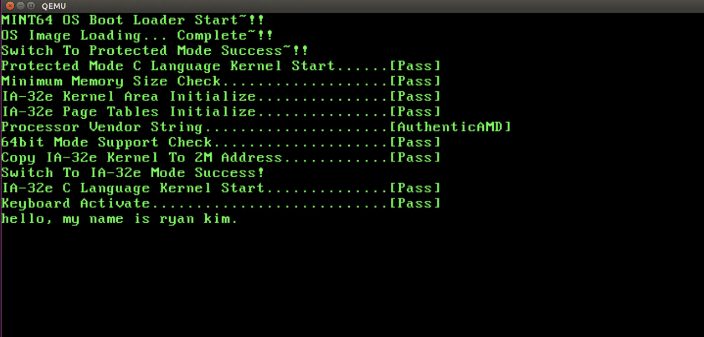

### 키보드 컨트롤러의 구조와 기능

#### 키보드 컨트롤러  
PC내부 버스와 포트 I/O 방식으로 연결되어 있음  
포트 어드레스는 `0x60`과 `0x64`를 사용  
데이터를 읽을때/쓸 때 접근하는 레지스터가 다르므로, 실제로 네 개의 레지스터와 연결.  

키보트 레지스터  
- 컨트롤 레지스터  
- 상태 레지스터   
- 입력 버퍼  
- 출력 버퍼  


### 키보드 컨트롤러 제어

#### 키보드와 키보드 컨트롤러 활성화
일반적으로 부트 로더가 실행되기 전에 키보드는 이미 BIOS에 의해 활성화된 상태.

키보드 컨트롤러에서 키보드 디바이스를 사용 가능하게 하려면    
`커맨드 포트`로 키보드 디바이스 활성화 커맨드인 `0xAE`를 보내면 됨.    
키보드에도 활성화 커맨드를 보내줄 필요가 있음.  
//키보드 컨트롤러와 키보드는 PS/2 방식의 케이블로 연결되어 있으며 PC의 외부에 존재


<키보드 활성화>  
커맨드 포트에 `0xAE`를 보냄.
키보드로 커맨드를 보내는 것은 버퍼의 상태 처리와 키보드의 응답 처리를 해야 하므로 까다로움.  

키보드 컨트롤러의 상태 레지스터(포트 0x64)  
: 키보드 컨트롤러의 상태 확인   

입력 버퍼 상태 비트(비트 1): 입력 버퍼가 비었는지 확인한 후 키보드 커맨드를 송신  
출력 버퍼 상태 비트(비트 0): 출력 버퍼에 데이터가 있는지 확인한 후 실행 결과를 읽음.


키보드 컨트롤러와 키보드를 활성화하는 코드
```
 //Check if there is received data in output beffer(port 0x60)
 BOOL kIsOutputBufferFull(void){

 	if(kInPortByte(0x64) & 0x01){
 		return TRUE;
 	}
 	return FALSE;
}

//If there are left data in input beffer(port 0x64)
BOOL kIsInputBufferFull(void){

	if(kInPortByte(0x64) & 0x02){
		return TRUE;
	}
	return FALSE;
}

//Activate Keboard
BOOL kActivateKeyboard(void){
	int i;
	int j;

	//activate keyboard device : trasfer keyboard activation command(0xAE) to control register(port 0x64)
	kOutPortByte(0x64, 0xAE);

	for(i=0; i<0xFFFF; i++){
		if(kIsInputBufferFull() == FALSE){
			break;
		}
	}

	//Transmit keyboard activation command(0xF4) to input buffer(port 0x60)
	kOutPortByte(0x60, 0xF4);


	//wait for ACK
	for(j=0; j<100; j++){
		for(i=0; i<0xFFFF; i++){
			if(kIsOutputBufferFull() == TRUE){
				break;
			}
		}
	}

	if(kInPortByte(0x60) == 0xFA){
		return TRUE;
	}
	return FALSE;
}
```

키보드는 커맨드를 성공적으로 처리했을 때 ACK(0xFA)를 전송하는데, 이때 ACK가 전달되기 전에 몇몇 키값이 이미 출력 버퍼에 들어 있을 수 있음. 따라서 출력 버퍼를 계속 읽어 뒤쪽에 삽입된 ACK(0xFA)를 찾아야 함.

kOutPortByte(), kInPortByte() 함수: 어셈블리어의 OUT, IN 명령어를 수행하는 어셈블리어 함수.  


kINPortByte(),  kOutPortByte() 함수 코드  
```
;read 1 byte from port
;PARAM: port #
kInPortByte:
	push rdx

	mov rx, rdi
	mov rax, 0
	in al, dx

	pop rdx
	ret

;write 1 byte to port
;PARAM: port #, data
kOutPortByte:
	push rdx
	push rax

	mov rdx, rdi
	mov rax, rsi
	out dx, al

	pop rax
	pop rdx
	ret
```

코드를 보면 보호 모드와 달리 파리마터를 스택에서 넘겨받지 않고 `RDI`나 `RSI`레지스터로 넘겨받음.  
이는 보호 모드와 IA-32e 모드의 함수 호출 규약이 서로 다르기 때문.


#### IA-32e 모드의 호출 규약  
C코드에서 어셈블이어 함수를 호출하려면 호출 규약을 지켜야 한다.

IA-32e 모드의 C 호출 규약 vs 보호 모드의 C 호출 규약   
1. IA-32e 모드는 파라미터 전달 시 레지스터를 우선으로 사용한다.    
	파라미터로 사용하는 레지스터는 파라미터 `타입`에 따라 다름.  
	정수 타입 : RDI, RSI, RDX, RCX, R8, R9 순서로 모두 6개   
	실수 타입 : XMM0 ~ XMM7 순서로 모두 8개 사용   

	파라미터 수가 정해진 레지스터의 수를 넘으면 보호 모드와 마찬가지로 스택 영을 사용.   

2. 레지스터 또는 스택에 파라미터를 삽입하는 순서가 다르다.   
	보호 모드 : 파라미터 리스트의 오른쪽 -> 왼쪽 으로 이동하면서 파라미터를 스택에 삽입  
	64비트 모드 : 왼쪽 -> 오른쪽으로 이동하면서 레지스터나 스택을 사용하여 삽입.   

3. 함수의 반환값으로 사용하는 레지스터     
	보호 모드 : EAX 레지스터를 사용하여 반환 값을 처리    
	64비트 모드  
			- 정수 타입: RAX 또는 RAX와 RDX 레지스터 사용하여 반환 값 처리     
			- 실수 타입 : XMM0 또는 XMM0과 XMM1 레지스터 사용.   

일반적으로 RAX 레지스터와 XMM0 레지스터를 사용함.    


#### 키보드 컨트롤러에서 키 값 읽기  
키보드는 키가 눌리거나 떨어질 때마다 키 별로 할당된 특수한 값을 키보드 컨트롤러로 전달.  
이 값을 `스캔 코드(Scan Code)` 라고 한다.  


키보드 컨트롤러에서 키 값(스캔 코드)을 읽는 코드
```
BYTE kGetKeyboardScanCode(void){
	//wait untile there is data in output buffer(port 0x60)
	while(kIsOutputBufferFull() == FALSE){
		;
	}
	return kInPortByte(0x60);
}
```

#### A20 게이트 활성화와 프로세스 리셋
키보드 컨트롤러의 출력 트는 키보드와 마우스 외에 `A20 게이트`와 `프로세서 리셋에 관련된 라인`과도 연결되어 있음.   
--> 출력 포트의 해당 비트를 1로 설정해서 A20 게이트를 활성화하거나 프로세서를 리셋할 수 있음.


A20 게이트 비트 : 출력 포트의 비트 1   
프로세서 리셋 비트 : 출력 포트의 비트 0   

키보드 컨트롤러의 출력 포트는 `0xD0`, `0xD1`커맨드로 접근 가능.   

출력 포트에서 데이터를 읽어오는 `0xD0` 커맨드로 현재 출력 포트의 값을 읽고 나서   
-> 비트 1을 1로 설정하여 A20 게이트 비트만 변경  
-> 그 값을 다시 `0xD1` 커맨드로 키보드 컨트롤러의 출력 포트에 보내여 A20 게이트를 활성화


키보드 컨트롤러를 통해 A20 게이트를 활성화하는 코드
```
void kEnableA20Gate(void){
	BYTE bOutputPortDat;
	int i;

	//trasmit command(0xD0) that reads the value of output port of keyboard controler to control register(port 0x64)
	kOutPortByte(0x64, 0xD0);

	//wiat for data of output port
	for(i=0; i<0xFFFF; i++){
		if(kIsOutputBufferFull() == TRUE){
			break;
		}
	}
	//read received output port value of keyboard controler (port 0x60)
	bOutputPortData = kInPortByte(0x60);

	//set A20 GATE bit
	bOutputPortData != 0x02;

	//If the input buffer(port 0x60) is empty, transmit command that writes a value to output port, and output port data
	for(i=0 ; i<0xFFFF; i++){
		if(kIsInputBufferFull() == FALSE){
			break;
		}
	}

	kOutPortByte(0x64, 0xD1);
	kOutPortByte(0x60, bOutputPortData);
}
```


#### 키보드 LED 상태 제어  
1. 키보드 LED 상태를 변경하려면 입력 버퍼(port 0x60)로 0xED 커맨드를 전송해서 키보드에 LED 상태 데이터가 전송될 것임을 미리 알림    
2. 키보드가 커맨드를 잘 처리했는지 ACK 를 확인  
3. LED 상태를 나타내는 데이터를 전송.


LDE 상태 데이터    
1 바이트 중 `하위 3바이트`만을 사용.   
Caps Lock - bit 2  
Num Lock - bit 1  
Scroll Lock - bit 0  

1 : ON   
0 : OFF  


키보드의 상태 LDE를 제어하는 코드
```
BOOL kChangeKeyboardLED(BOOL bCapsLockOn, BOOL bNumLockOn, BOOL bScrollLockOn){
	int i, j;

	//transmit LDE change command to keyboard and wait untile it is processed.
	for(i=0; i<0xFFFF; i++){
		if(kIsInputBufferFull() == FALSE){
			break;
		}
	}

	//transmit LED state change command(0xED) to input buffer(0x60)
	kOUtPortByte(0x60, 0xED);
	for(i=0; i<0xFFFF; i++){
		if(kIsInputBufferFull() == FALSE){
			break;
		}
	}

	//wait ACK
	for(j=0; j<100; j++){
		for(i=0; i<0xFFFF; i++){
			if(kIsOutputBufferFull() == TRUE){
				break;
			}
		}

		//if the data from output buffer(port 0x60) is ACK(0xFA) -> success
		if(kInPortByte(0x60) == 0xFA){
			break;
		}
	}

	if(j >= 100){
		return FALSE;''
	}

	//transmit LED cahnge value to keyboard and wait untile it's done
	kOutPortByte(0x60, (bCapsLockOn << 2) | (bNumLockOn << 1) | bScrollLockOn);
	for(i=0; i<0xFFFF; i++){
		if(kIsInputBufferFull() == FALSE){
			break;
		}
	}

	/wait ACK
	for(j=0; j<100; j++){
		for(i=0; i<0xFFFF; i++){
			if(kIsOutputBufferFull() == TRUE){
				break;
			}
		}

		//if the data from output buffer(port 0x60) = ACK(0xFA) -> SUCCESS
		if(kInPortByte(0x60) == 0xFA){
			break;
		}
	}
	if(j >= 100){
		return FALSE;
	}
	return TRUE;
}
```


### 스캔 코드와 간단한 셸
수신된 데이터를 처리하여 ASCII 코드 형태로 변환.   
키보드는 `스캔 코드`를 전달하기 때문에, 두 코드 간에 변환이 필요.  


#### 키보드와 스캔 코드

키보드는 눌리거나 떨어질 때마다 해당 키에 대한 고유 코드 전송.   
키 이벤트에 대한 고유 코드 = `스캔 코드`


Key down 과 Key up 의 값이 다르며, 일반적으로 Up 의 값은 Down의 최상위 비트(비트 7)을 1로 설정한 값과 같다.  
(== + 0x80)

Down 일 때 값 + 0x80 의 방식으로 처리 -> Up 일 때의 값을 가지고 있지 않아도 됨.

`확장키`는 일반 키와 달리 2개 이상의 코드로 구성  
다른 키와 달리 `0xE0`나 `0xE1`로 시작한다는 공통점이 있음  
-> 해당 스캔 코드가 수신되었을 때 이를 판단하여 처리

스캔 코드를 ASCII 문자로 변경해야 함.


#### 스캔 코드를 ASCII 문자로 변환
변환 작업을 쉽게 하는 일반적인 방법: 테이블  
확장 키를 제외한 스캔 코드의 수 = 0x58 (88개)   
스캔 코드의 값을 테이블 인덱스로 사용하여 ASCII 값을 구하는 변환 테이블을 만들어 사용  


스캔 코드를 ASCII 코드로 매핑하는 테이블
```
static KEYMAPPINGENTRY gs_vstKeyMappingTable[ KEY_MAPPINGTABLEMAXCOUNT ] =
{
    /*  0   */  {   KEY_NONE        ,   KEY_NONE        },
    /*  1   */  {   KEY_ESC         ,   KEY_ESC         },
    /*  2   */  {   '1'             ,   '!'             },
    /*  3   */  {   '2'             ,   '@'             },
    /*  4   */  {   '3'             ,   '#'             },
    /*  5   */  {   '4'             ,   '$'             },
    /*  6   */  {   '5'             ,   '%'             },
    /*  7   */  {   '6'             ,   '^'             },
    /*  8   */  {   '7'             ,   '&'             },
    /*  9   */  {   '8'             ,   '*'             },
    /*  10  */  {   '9'             ,   '('             },
    /*  11  */  {   '0'             ,   ')'             },
    /*  12  */  {   '-'             ,   '_'             },
    /*  13  */  {   '='             ,   '+'             },
    /*  14  */  {   KEY_BACKSPACE   ,   KEY_BACKSPACE   },
    /*  15  */  {   KEY_TAB         ,   KEY_TAB         },
    /*  16  */  {   'q'             ,   'Q'             },
    /*  17  */  {   'w'             ,   'W'             },
    /*  18  */  {   'e'             ,   'E'             },
    /*  19  */  {   'r'             ,   'R'             },
    /*  20  */  {   't'             ,   'T'             },
    /*  21  */  {   'y'             ,   'Y'             },
    /*  22  */  {   'u'             ,   'U'             },
    /*  23  */  {   'i'             ,   'I'             },
    /*  24  */  {   'o'             ,   'O'             },
    /*  25  */  {   'p'             ,   'P'             },
    /*  26  */  {   '['             ,   '{'             },
    /*  27  */  {   ']'             ,   '}'             },
    /*  28  */  {   '\n'            ,   '\n'            },
    /*  29  */  {   KEY_CTRL        ,   KEY_CTRL        },
    /*  30  */  {   'a'             ,   'A'             },
    /*  31  */  {   's'             ,   'S'             },
    /*  32  */  {   'd'             ,   'D'             },
    /*  33  */  {   'f'             ,   'F'             },
    /*  34  */  {   'g'             ,   'G'             },
    /*  35  */  {   'h'             ,   'H'             },
    /*  36  */  {   'j'             ,   'J'             },
    /*  37  */  {   'k'             ,   'K'             },
    /*  38  */  {   'l'             ,   'L'             },
    /*  39  */  {   ';'             ,   ':'             },
    /*  40  */  {   '\''            ,   '\"'            },
    /*  41  */  {   '`'             ,   '~'             },
    /*  42  */  {   KEY_LSHIFT      ,   KEY_LSHIFT      },
    /*  43  */  {   '\\'            ,   '|'             },
    /*  44  */  {   'z'             ,   'Z'             },
    /*  45  */  {   'x'             ,   'X'             },
    /*  46  */  {   'c'             ,   'C'             },
    /*  47  */  {   'v'             ,   'V'             },
    /*  48  */  {   'b'             ,   'B'             },
    /*  49  */  {   'n'             ,   'N'             },
    /*  50  */  {   'm'             ,   'M'             },
    /*  51  */  {   ','             ,   '<'             },
    /*  52  */  {   '.'             ,   '>'             },
    /*  53  */  {   '/'             ,   '?'             },
    /*  54  */  {   KEY_RSHIFT      ,   KEY_RSHIFT      },
    /*  55  */  {   '*'             ,   '*'             },
    /*  56  */  {   KEY_LALT        ,   KEY_LALT        },
    /*  57  */  {   ' '             ,   ' '             },
    /*  58  */  {   KEY_CAPSLOCK    ,   KEY_CAPSLOCK    },
    /*  59  */  {   KEY_F1          ,   KEY_F1          },
    /*  60  */  {   KEY_F2          ,   KEY_F2          },
    /*  61  */  {   KEY_F3          ,   KEY_F3          },
    /*  62  */  {   KEY_F4          ,   KEY_F4          },
    /*  63  */  {   KEY_F5          ,   KEY_F5          },
    /*  64  */  {   KEY_F6          ,   KEY_F6          },
    /*  65  */  {   KEY_F7          ,   KEY_F7          },
    /*  66  */  {   KEY_F8          ,   KEY_F8          },
    /*  67  */  {   KEY_F9          ,   KEY_F9          },
    /*  68  */  {   KEY_F10         ,   KEY_F10         },
    /*  69  */  {   KEY_NUMLOCK     ,   KEY_NUMLOCK     },
    /*  70  */  {   KEY_SCROLLLOCK  ,   KEY_SCROLLLOCK  },

    /*  71  */  {   KEY_HOME        ,   '7'             },
    /*  72  */  {   KEY_UP          ,   '8'             },
    /*  73  */  {   KEY_PAGEUP      ,   '9'             },
    /*  74  */  {   '-'             ,   '-'             },
    /*  75  */  {   KEY_LEFT        ,   '4'             },
    /*  76  */  {   KEY_CENTER      ,   '5'             },
    /*  77  */  {   KEY_RIGHT       ,   '6'             },
    /*  78  */  {   '+'             ,   '+'             },
    /*  79  */  {   KEY_END         ,   '1'             },
    /*  80  */  {   KEY_DOWN        ,   '2'             },
    /*  81  */  {   KEY_PAGEDOWN    ,   '3'             },
    /*  82  */  {   KEY_INS         ,   '0'             },
    /*  83  */  {   KEY_DEL         ,   '.'             },
    /*  84  */  {   KEY_NONE        ,   KEY_NONE        },
    /*  85  */  {   KEY_NONE        ,   KEY_NONE        },
    /*  86  */  {   KEY_NONE        ,   KEY_NONE        },
    /*  87  */  {   KEY_F11         ,   KEY_F11         },
    /*  88  */  {   KEY_F12         ,   KEY_F12         }
};
```


키 값을 ASCII 문자로 변환하려면 Shift 키와 Caps Lock 키, Num Lock 키, 즉 `조합키`의 상태를 알고 있어야 한다.  
키보드 상태를 저장하는 자료 구조를 정의하여 조합키의 상태를 추가.  

2개 이상이 조합 된 `확장 키(Extended Key)`도 처리해야 함.
확장 키 중에서 Pause 를 제외한 나머지 키들은 확장 키임을 알리는 `0xE0`코드를 먼저 전송.  
-> `0xE0`를 수신했을 때 다음에 오는 키 값을 기다렸다가 처리.

Pause는 `0xE1` `0x1D` `0x45` 처럼 3개의 코드가 조합되고 Up Code 가 없음  
-> `0xE1` 이 수신되었을 때 Pause를 미리 처리하고 나머지 키 코드 2개를 무시하는 방법으로 처리.


키보드 키 상태를 관리하는 자료구조
```
typedef struct kKeyboardManagerStruct{
  BOOL bShiftDown;
  BOOL bCapsLockOn;
  BOOL bNumLockOn;
  BOOL bScrollLockOn;

  BOOL bExtendedCodeIn; //Flag for extended key
  int iSkipCountForPause; //The value for Pause.
} KEYBOARDMANAGER;
```


이제 본격적으로 스캔 코드를 ASCII 코드로 변환.  
정확히 변환 하려면 조합 키의 상태에 따라 영향을 받는 지 여부를 알아야 한다.

각 그룹별로 영향을 받는 조합 키가 다름.    
따라서 정확하게 변환 하려면  
  스캔 코드를 그룹으로 분류 -> 관련된 조합 키의 상태에 따라 적절한 코드로 변환  


조합된 키를 선택해야 하는지 여부를 반환하는 함수의 코드
```
BOOL kIsUseCombinedCode(BYTE bScanCode){
  BYTE bDownScanCode;
  BOOL bUseCombinedKey = FALSE;

  bDownScanCode = bScanCode & 0x7F;

  //Alphabet key : is affected by Shift and Caps Lock
  if(kIsAlphabetScanCode(bDownScanCode) == TRUE){
    //if only one of Shift and Cpas Lock were down, return combined key.
    if(gs_stKeyboardManager.bShiftDown ^ gs_stKeyboardManager.bCapsLockOn){
      bUseCombinedKey = TRUE;
    }else{
      bUseCombinedKey = FALSE;
    }
  }
  //number and symbol keys are affected by Shift key
  else if(kIsNumberOrSymbolScanCode(bDownScanCode) == TRUE){
    //Shift
    if(gs_stKeyboardManager.bShiftDown == TRUE){
      bUseCombinedKey = TRUE;
    }else{
      bUseCombinedKey = FALSE;
    }
  }

  //Numpad <- Num Lock
  //0xE0만 제외하면 확장 키 코드와 숫자 패드의 코드가 겹치므로,
  //확장 키 코드가 수신되지 않았을 때만 조합된 코드 사용.
  else if((kIsNumberPadScanCode(bDownScanCode) == TRUE) &&
      (gs_stKeyboardManager.bExtendedCodeIn == FALSE)){
          //Num Lock key down
          if(gs_stKeyboardManager.bNumLockOn == TRUE){
            bUseCombinedKey == TRUE;
          }else{
            bUseCombinedKey == FALSE;
          }
      }

      return bUseCombinedKey;
}

//check if the scan code is in the range of alphabet.
BOOL kIsAlphabetScanCode(BYTE bScanCode){
  if(('a' <= gs_vstKeyMappingTable[bScanCode].bNormalCode) &&
      (gs_vstKeyMappingTable[bScanCode].bNormalCode <= 'z')){
        return TRUE;
  }
      return FALSE;
}

//check if it's number or symbol
BOOL kIsNumberOrSymbolScanCode(BYTE bScanCode){
  //숫자 패드나 확장 키 범위를 제외한 범위(스캔 코드 2 ~ 53)에서 영문자가 아니면
  //숫자 또는 기호임
  if((2 <= bScanCode) && (bScanCode <= 53) &&
      (kIsAlphabetScanCode(bScanCode) == FALSE)){
        return TRUE;
  }
  return FALSE;
}

BOOL kIsNumberPadScanCode(BYTE bScanCode){
  if((71 <= bScanCode) && (bScanCode <= 83 )){
    return TRUE;
  }
  return FALSE;
}
```


스캔 코드가 조합 키나 LED 상태 변경이 필요한 키일 때 처리

조합 키의 상태를 갱신하는 코드
```
void UpdateCombinationKeyStatusAndLED(BYTE bScanCode){
  BOOL bDown;
  BYTE bDOwnScanCode;
  BOOL bLEDStatusChanged = FALSE;

  //MSB(bit 7) = 1 -> Key UP
  //MSB = 0 -> Key DOWN
  if(bScanCode & 0x80){
    bDown = FALSE;
    bDownScanCode = bScanCode & 0x7F;
  } else{
    bDown = TRUE;
    bDownScanCode = bScancode;
  }

  //search for the combined key
  //Scan code of Shift key(42 or 54) -> update Shift status
  if((bDownScanCode == 42) || (bDOwnScanCode == 54)){
    gs_stKeyboardManager.bShiftDown = bDown;
  }
  //Scan code of Caps Lock(58) -> update Caps Lock status and LED
  else if((bDOwnScanCode == 58) && (bDown == TRUE)){
    gs_stKeyboardManager.bNumLockOn ^= TRUE;
    bLEDStatusChanged = TRUE;
  }
  //Scan code of Scroll Lock(70) -> update Scroll Lock status and LED
  else if((bDOwnScanCode == 70) && (bDown == TRUE)){
    gs_stKeyboardManager.bScrollLockOn ^= TRUE;
    bLEDStatusChanged = TRUE;
  }

  //If the status of LED changed, send command to keyboard to update LED.
  if(bLEDStatusChanged == TRUE){
    kChangeKeyboardLED(gs_stKeyboardManager.bCapsLockOn,
        gs_stKeyboardManager.bNumLockOn, gs_stKeyboardManager.bScrollLockOn);
  }
}
```

확장 키 처리.  
확장 키는 2개 이상의 스캔 코드로 구성.  
두 번째 또는 세 번째까지 키를 확인해야 정확한 키 값을 찾을 수 있음.  

Pause 키 : 다른 확장 키와 달리 `0xE1` 로 시작
Pause 키를 제외한 다른 확장 키 : `0xE0`와 일반 키의 스캔 코드가 전송됨.

  Pause 키의 경우 : `0xE1` 수신 뒤 나머지 무시
  다른 확장 키 : `0xE0`  수신 했을 때 확장 키임을 저장해둔 후 다음 키가 수신되었을 때 ASCII 코드와 함께 확장 키임을 알려줌


스캔 코드를 ASCII 코드로 변환하는 함수의 코드
```
#define KEY_SKIPCOUNTFORPAUSE 2

#define KEY_FLAGS_UP          0x00
#define KEY_FLAGS_DOWN        0x01
#define KEY_FLAGS_EXTENDEDKEY 0x02

BOOL kConvertScanCodeToASCIICode(BYTE bScanCode, BYTE* pbASCIICode, BOOL* pbFlags){
BOOL bUseCombinedKey;

  if(gs_stKeyboardManager.iSkipCountForPause > 0){
    gs_stKeyboardManager.iSkipCountForPause--;
    return FALSE;
  }

  //Pause
  if(bScanCode == 0xE1){
    *pbASCIICode = KEY_PAUSE;
    *pbFlags = KEY_FLAGS_DOWN;
    gs_stKeyboardManager.iSkipCountForPause = KEY_SKIPCOUNTFORPAUSE;
    return TRUE;
  }
  else if(bScanCode = 0xE0){
    gs_stKeyboardManager.bExtendedCodeIn = TRUE;
    return FALSE;
  }

  bUseCombinedKey = kIsUseCombinedCode(bScanCode);

  if(bUseCombinedKey == TRUE){
    *pbASCIICode = gs_vstKeyMappingTable[bScanCode & 0x7F].bCombinedCode;
  }else{
    *pbASCIICode = gs_vstKeyMappingTable[bScanCode & 0x7F].bNormalCode;
  }

  //set or unset extended key
  if(gs_stKeyboardManager.bExtendedCodeIn == TRUE){
    *pbFlags = KEY_FLAGS_EXTENDEDKEY;
    gs_stKeyboardManager.bExtendedCodeIn = FALSE;
  }else{
    *pbFlags = 0;
  }

  //set or unset Key Down or Key Up
  if((bScanCode & 0x80) == 0){
    *pbFlags |= KEY_FLAGS_DOWN;
  }

  //update combined key down or up
  UpdateCombinationKeyStatusAndLED(bScanCode);
  return TRUE;
}
```

#### 간단한 셸 구현
키보드 디바이스 드라이버의 테스트를 위해 입력된 키 값을 화면에 출력하는 셸을 구현.  

셸 : 사용자에게서 명령을 받아 작업을 수행하는 프로그램으로 OS와 유저를 연결해주는 역할

입력된 스캔 코드를 변환하여 화면에 순차적으로 출력하는 기능 구현.  

입력된 키를 화면에 출력하는 간단한 셸 코드
```
char vcTemp[2] = {0, };
BYTE bFlags;
BYTE bTemp;
int i = 0;

while(1){
  //It can read scan code if the output buffer(port 0x60) is not empty
  if(kIsOutputBufferFull() == TRUE){
    bTemp = kGetKeyboardScanCode();

    if(kCOnvertScanCodeToASCIICode(bTemp, &(vcTemp[0]), &bFlags) == TRUE){
      if(bFlags & KEY_FLAGS_DOWN){
        kPrintString(i++, 13, vcTemp);
      }
    }
  }
}
```


### 키보드 디바이스 드라이버의 통합과 빌드.   

#### 키보드 디바이스 드라이버 파일 추가   
02.Kernel64/Source 디렉터리    
- Keyboard.c  
- Keyboard.h  


#### 어셈블리어 유틸리티 파일 추가
키보드 디바이스 드라이버에서 사용하는 `kInPortByte()` 와 `kOutPortByte()` 함수는 실제로 어셈블리어 명령인 `in`과 `out`을 호출하는 어셈블리어 함수.  
커널 디바이스 드라이버가 정상적으로 링크되려면, 어셈블리어 함수가 정의된 오브젝트 파일이 필요.  

어셈블리어 함수를 추가하는 용도로 다음 파일 작성.    
02.Kernel64/Source 디렉터리   
- AssemblyUtility.asm  
- AssemblyUtility.h  

#### C언어 커널 엔트리 포인트 파일 수정  
11장에서 추가된 기능을 수행할 수 있도록 키보드 컨트롤러와 키보드를 활성화하고 간단한 셸을 실행.  

02.Kernel64/Source 디렉터리
- Main.c 수정.

## 실행 결과

</img><br/>
