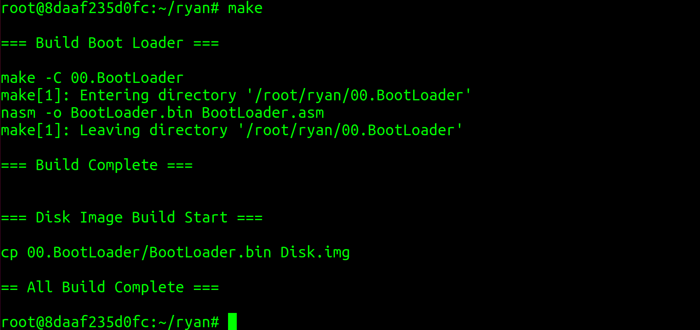

# 4 내 PC를 부팅하자 

### 최상위 디렉터리의 makefile  (/ryan/makefile)
OS 이미지 생성을 위해 각 하위 디렉터리의 makefile을 실행하는 것. 
clean Target : 빌드 과정에서 생성된 파일을 삭제할 목적으로 정의 
                하위 디렉터리에 clean Target을 실행하여 처리하는 구조 
                

### /00.BootLoader/makefile 
BootLoader.asm파일을 nasm 어셈블리어 컴파일러로 빌드하여 BootLoader.bin 파일을 생성

### /00.BootLoader/BootLoader.asm
부트 로더를 메모리에 정상적으로 복사하려면, 부트 섹터 512 바이트에서 마지막 2바이트를 `0x55`, `0xAA`로 저장하면 된다. 

빌드가 정상적으로 끝나면 OS의 최상위 디렉터리에 Disk.img 파일이 생성됨 
</img> 

##QEUM 실행 
</img> 

</img> 

