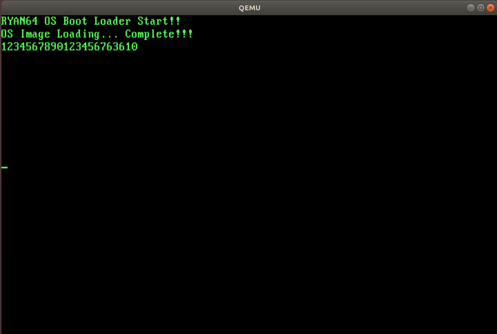

### 5.2 이미지 로딩 기능 구현  
제작중인 OS의 이미지는 크게 `부트 로더`, `보호 모드 커널`, `IA-32e 모드 커널`로 구성.  
각 부분은 `섹터 단위`로 정렬해서 하나의 부팅 이미지 파일로 합침.  
따라서 디스크의 두 번째 섹터부터 읽어서 특정 메모리 어드레스에 순서대로 복사하면 이미지 로딩은 끝.  

플로피 디스크의 첫 번째 섹터는 `부트 로더`로 BIOS가 메모리에 로딩.  
따라서 플로피 디스크의 두 번째 섹터부터 OS 이미지의 크기 만큼을 읽어서 메모리에 복사하면 된다.  


1024 섹터 크기의 이미지를 메모리로 복사하는 소스 코드(C언어)  
```
int main(int argc, char* argv[]){
  int iTotalSectorCount = 1024;
  int iSectorNumber = 2;
  int iHeadNumber = 0;
  int iTrackNumber = 0;

  char* pcTargetAddress = (char*) 0x10000;

  while(1){
    if(iTotalSectorCount == 0){
      break;
    }
    iTotalSectorCount = iTotalSectorCount - 1;

    if(BIOSReadOneSector(iSectorNumber, iHeadNumber, iTrackNumber,
      pcTargetAddress) == ERROR){
        HandleDiskError();
      }

      //1 섹터는 512(0x2000) 바이트이므로, 복사한 섹터 수만큼 어드레스 증가
      pcTargetAddress pcTargetAddress + 0x200;

      //섹터 -> 헤드 -> 트랙 순으로 번호 증가
      iSectorNumber = iSectorNumber + 1;
      if(iSectorNumber < 19){
        continue;
      }

      iHeadNumber = iHeadNumber ^ 0x10;
      //iHeadNumber = (iHeadNumber == 0x00)? 0x01:0x00;

      if(iHeadNumber != 0){
        continue;
      }

      iTrackNumber = iTrackNumber + 1;
  }
  return 0;
}

void HandleDiskError(){
  print("DISK Error!");
  while(1);
}
```


1024 섹터 크기의 이미지를 메모리로 복사하는 소스 코드(어셈블리어)  
```
TOTALSECTORCOUNT: dw 1024 ; 부드 로더를 제외한 OS 이미지 크기. 최대 1251섹터(0x900000byte까지 가능)
SECTORNUMBER: db 0x02 ;OS 이미지가 시작하는 섹터 번호
HEADNUMBER: db 0x0000 ;OS 이미지가 시작하는 헤드 번호
TRACKNUMBER: db 0x00  ;OS 이미지가 시작하는 트랙 번호
  ;디스크의 내용을 메모리로 복사할 어드레스(ES:BX)를 0x10000으로 설정
  mov si, 0x10000
  mov es, si
  mov bx, 0x0000
  mov di, word [TOTALSECTORCOUNT] ;복사할 OS 이미지의 섹터 수를 DI 레지스터에 설정

READDATA:
  ;모든 섹터 다 읽었는지 확인
  cmp di, 0
  je READEND  ;복사할 섹터 수가 0이라면 다 복사 헀으므로 READEND로 이동
  sub di, 0x1

  ;BIOS READ Function 호출
  mov ah, 0x02                    ;BIOS 서비스 번호 2
  mov al, 0x10                    ;읽을 섹터 수 1
  mov ch, byte [TRACKNUMBER]      ;읽을 트랙 번호
  mov cl, byte [SECTORNUMBER]     ;읽을 섹터 번호
  mov dh, byte [HEADNUMBER]       ;읽을 헤드 번호
  mov dl, 0x0000                  ;읽을 드라이브 번호(0=Floppy) 설정
  int 0x13                        ;인터럽트 서비스 수행
  jc HANDLEDISKERROR              ;에러가 발생시 HANDLEDISKERROR로 이동

  ;복사할 어드레스, 트랙, 헤드, 섹터 어드레스 계산
  add si, 0x0020
  mov es, si

  mov al, byte [SECTORNUMBER]
  add al, 0x01
  mov byte [SECTORNUMBER], al
  cmp al, 19
  jl READDATA

  ;마지막 섹터 까지 읽었으면(섹터 번호가 19이면) 헤드를 토글 (0->1, 1->0)하고,
  ;섹터 번호 1로 설정
  xor byte [HEADNUMBER], 0x01     ;헤드 번호 토글
  mov byte [SECTORNUMBER], 0x01

  ;헤드가 1->0 으로 바뀌었으면, 양쪽 헤드 모두 읽은 것이므로 아래로 이동하여 트랙번호 1 증가
  cmp byte [HEADNUMBER], 0x0000
  jne READDATA

  ;트랙 1 증가 후, 다시 섹터 읽기로 이동
  add byte [TRACKNUMBER], 0x01
  jmp READDATA
READEND:

HANDLEDISKERROR:
... 생략 ...
  jmp $  
```


### 5.2.2 스택 초기화와 함수 구현  
x86 프로세서 - 스택 관련 레지스터 세 가지  
- 스택 세그먼트 레지스터(SS): 스택 영역으로 사용할 세그먼트의 기준 주소 지정  
- 스택 포인터 레지스터(SP): 데이터를 삽입/제거하는 TOP을 지정  
- 베이스 포인터 레지스터(BP): 스택의 기준 주소를 임시로 지정할 때 사용   


부트 로더에 스택 생성.
0x010000(64KB) 어드레스부터는 OS 이미지가 로딩되므로,  
0x010000이하, 즉 0x0000:0000 ~ 0x0000:0xFFFF 영역을 사용.
-> SS = 0x0000, SP와 BP = 0xFFFF(스택 영역의 크기를 세그먼트의 최대 크기로 지정)  

스택 초기화 코드
```
;스택을 0x0000:0000 ~ 0x0000:FFFF 영역에 64KB 크기로 생성
mov ax, 0x010000
mov ss, ax
mov sp, 0xFFFE
mov bp, 0xFFFE
```


어셈블리어 함수의 일반적인 형식
```
push bp
mov bp, sp

push es
push si
push di
push ax
push cx
push dx

...생략...

mov ax, word [bp+4] ; 파라미터 1
mov bx, word [bp+6] ; 파라미터 2
mvo cd, word [bp+8] ; 파라미터 3

...생략...

pop dx    ;스택이므로 삽입의 역순으로 제거해야 함
pop cx
pop ax
pop di
pop si
pop es
pop bp
ret       ; 함수를 호출한 다음 코드의 위치로 복귀
```


함수 형태로 수정된 PRINTMESSAGE 함수의 코드
```
;PARAM: x 좌표, y 좌표, 문자열
PRINTMESSAGE:
  push bp
  mov bp, sp

  push es
  push si
  push di
  push ax
  push cx
  push dx

  ;ES 세그먼트 레지스터에 비디오 모드 어드레스 설정
  mov ax, 0xB8000
  mov es, ax

  ;X, Y 좌표로 비디오 메모리의 어드레스 계산
  ;Y좌표를 이용해서 먼저 라인 어드레스 계산
  mov ax, word [bp+6]
  mov si, 160         ;한 라인의 바이트 수(2*80 컬럼)
  mul si              ;AX, SI 레지스터를 곱하여 화면 Y 어드레스 계산
  mov di, ax          ;계산된 화면 Y 어드레스를 DI 레지스터에 설정

  ;X좌표를 이용해서 2를 곱한 후 최종 어드레스 구함
  mov ax, word [bp+4]
  mov si, 2
  mul si
  add di, ax          ; 실제 비디오 메모리 어드레스 계산

  ;출력할 문자열 어드레스
  mov si, word [bp+8] ;파라미터 3

.MESSAGELOOP:
  mov cl, byte [si]   ;문자열은 1 바이트면 충분하므로 CX 레지스터의 하위 1바이트만 사용
  cmp cl, 0
  je .MESSAGEEND

  mov byte [es: id], cl

  add si, 1
  add di, 2

  jmp .MESSAGELOOP

.MESSAGEEND:
  pop dx
  pop cx
  pop ax
  pop di
  pop si
  pop es
  pop bp
  ret  
```

### 실행
</img><br/>


정상 실행 결과는 아님..  
숫자가 왜 나오나 마는지 알 수 X
