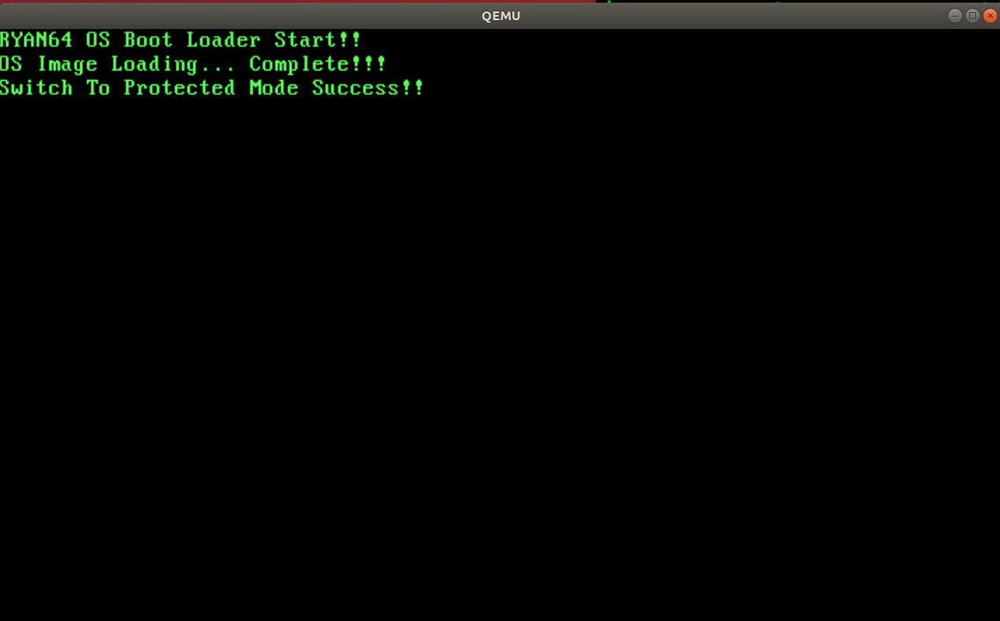

### 7.1 실행 가능한 C 코드 커널 생성 방법

이번 장에서 할 일 : C 소스 파일을 추가하고, 이를 빌드하여 보호 모드 커널 이미지에 통합.  
  - C언어로 작성한 커널을 보호 모드 엔트리 포인트의 뒷부분에 연결  
  - 엔트리 포인트에서는 C 커널의 시작 부분으로 이동.  

  <세 가지 제약 조건>
  1. C 라이브러리를 사용하지 않게 빌드해야한다.   
  2. 0x10200 위치에 실행하게끔 빌드해야함.  
  3. 코드나 데이터 외에 기타 정보를 포함하지 않은 순수한 바이너리 파일 형태여야 한다.   

### 7.1.2 소스 파일 컴파일 - 라이브러리를 사용하지 않는 오브젝트 파일 생성 방법
Main.c를 라이브러리를 사용하지 않는 Main.o로 컴파일하는 방법
```
gcc -c -m32 -ffreestanding Main.c
;-m32 : 2장에서 크로스 컴파일한 GCC가 기본적으로 64비트 코드를 생성하므로
;32비트 코드 셍성을 위한 옵션.
```


### 7.1.3 오브젝트 파일 링크 - 라이브러리를 사용하지 않고 특정 어드레스에서 실행 가능한 커널 이미지 파일 생성 방법

오브젝트 파일 링크하여 실행 파일 만들기  
  1. 섹션의 배치   
  2. 로딩될 어드레스   
  3. 엔트리 포인트  
  지정 필요  


#### 32비트용 스크립트 파일 섹션 재배치 작업  
텍스트나 데이터와 관계 없는 섹션(.tdata, .tbss, ctors, .got 등)의 기본 구조,    
즉, 'SectionName{...}' 부분 전체를 코드 및 데이터 섹션의 뒷부분으로 이동하거나   
코드 및 데이터에 관련된 섹션(.text, .data, .bss, .rodata)을 가장 앞으로 이동함으로써 처리 가능  


#### 로딩할 메모리 어드레스와 엔트리 포인트 지정   
C코드 역시 로딩될 메모리를 미리 예측하고 그에 맞춰 이미지를 생성하는 것이 중요.   
이미지를 로딩할 때 어드레스에 맞춰서 생성하지 않는다면 전역 변수와 같이 선형 어드레스를   
참조하는 코드는 모두 잘못된 어드레스에 접근하기 때문.  


### 7.2 C 소스 파일 추가와 보호 모드 엔트리 포인트 통합.
보호 모드 커널 디렉터리에 C 소스 파일을 추가하고 자동으로 포함하여 빌드 하기.

### C 소스 파일 추가.
C 커널 엔트리 포인트가 될 `Main.c` 소스를 위한 헤더 파일 생성

01.Kernel32/Source/Types.h
```
#ifndef __TYPES_H__
#define __TYPES_H__

#define BYTE  unsigned char
#define WORD  unsigned short
#define DWORD unsigned int
#define QWORD unsigned long
#define BOOL  unsigned char

#define TRUE 1
#define FLASE 0
#define NULL 0

#pragma pack(push, 1)

typedef struct kCharactorStruct{
  BYTE bCharactor;
  BYTE bAttribute;
} CHARACTER;

#pragma pack(pop)
#endif /*__TYPES_H__*/
```


`CHARACTER 타입`: 테긋트 모드 화면을 구성하는 문자 하나를 나타내는 구조체   
텍스트 모드용 비디오 메모리(0xB8000)에 문자를 편하게 출력할 목적


C 코드 엔트리 포인트 파일

01.Kernel32/Source/Main.c
```
#include "Types.h"

void kPrintString(int iX, int iY, const char* pcString);

void Main(void){
  kPrintString(0, 3, "C Language Kernel Started!");

  while(1);
}

void kPrintString(int iX, int iY, const char* pcString){
  CHARACTER* pstScreen = (CHARACTER*) 0xB8000;
  int i;

  pstScreen += (iY * 80) + iX;
  for(i=0; pcString[i] != 0; i++){
    pstScreen[i].bCharactor = pcString[i];
  }
}
```


### 보호 모드 엔트리 포인트 코드 수정  
보호 모드 커널의 엔트리 포인트 코드(EntryPoint.s) 이후에 C 커널 코드가 있으므로,  
0x10200으로 이동하게 변경.  

<C 커널  코드로 이동하게 수정하기>  
CS 세그먼트 셀렉터와 이동할 선형 주소를 jmp 명령에 같이 지정해 주면된다.

보호 모드 커널의 엔트리 포인트 코드(EntryPoint.s) 수정
```
[BITS 32]
PROTECTEDMODE:

... 생략 ...
push (SWITCHSUCCESSMESSAGE - $$ + 0x10000)
push 2
push 0
call PRINTMESSAGE
add esp, 12

;수정할 부분
jmp dword 0x08: 0x10200  ;C 커널이 존재하는 0x10200 어드레스로 이동하여 C 커널 수행
    ;CS 세그먼트 셀렉터를 커널 코드 디스크립터(0x08)로 변경하면서,
    ;0x10200 어드레스로 이동.
```


### makefile 수정
7장 부터는 다수의 파일을 컴파일하고 링크해야 하므로 make의 몇 가지 유용한 기능을 사용하여   
Source 디렉터리에 .c 확장자의 파일만 추가하면 자동으로 포함하여 빌드하게 수정  

빌드를 수행할 때마다 Source 디렉터리에 있는 *.c 파일을 검색하여 소스 파일 목록에 추가.
make가 '와일드 카드 기능' 제공.
```
CSOURCEFILES = $(wildcard Source/*.c)
```


파일들에 대한 빌드 룰 설정.  
파일 패턴에 대해 동일한 룰을 적용함으로써, 간단히 처리 가능  

확장자가 .c인 파일을 .o로 변경하는 룰 지정하는 예
```
%.o : %.c
  gcc -c $<
```

와일드카드와 패턴 룰 기능을 이용하면, Source dir내의 모든 C 파일을 자동으로 컴파일 가능  
*`patsubst` : 특정 문자 치환 기능
$(patsubst 수정할 패턴, 교체할 패턴, 입력 문자열) 형식


CSOURCEFILES 내의 목록의 확장자를 .c 에서 .o로 수정하여 COBJECTFIELS 변수로 지정하는 예
```
COBJECTFILES = $(patsubst %.c, %.o, $(CSOURCEFIELS))
```

### 실행

</img><br/>
