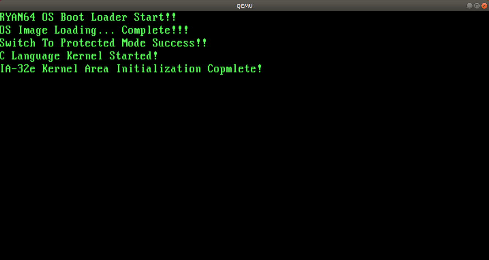
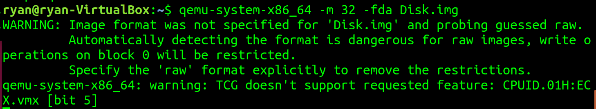
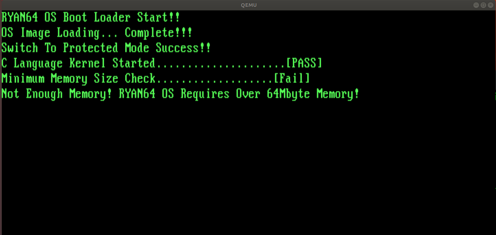
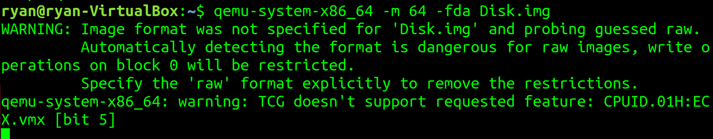
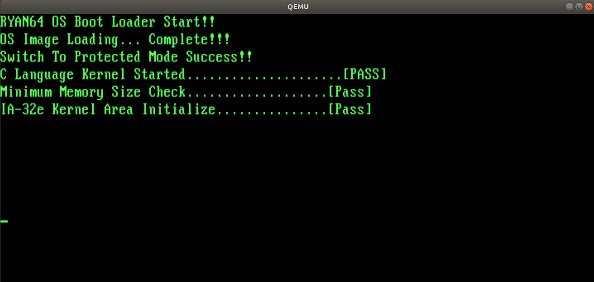

### 8.1 IA-32e 모드 커널과 메모리 맵

IA-32e 모드 커널일 실행하기 위한 준비 작업  
  - PC에 설치된 메모리가 64MB 이상인지 검사   
  - IA-32e 모드 커널이 위치할 영역을 모드 0으로 초기화   
  - 부팅 과정을 완료하고 나서 1MB 이상의 메모리에 정상 접근 되는지 확인   

IA-32e 모드 커널이 위치할 영역을 0으로 초기화 하는 이유.  
  이미지를 옮길 영역을 미리 0으로 초기화하지 않는다면 어떤 임의의 값이  
  들어 있을 것임. 이러한 상태에서 IA-32e 모드 커널이 실행되면 0으로  
  참조되어야 할 변수들이 0이 아닌 값으로 설정되어, 루프를 빠져 나오지 못한다든지  
  잘못된 조건문이 실행된다든지 하는 문제가 발생할 수 있음.  
  이러한 사태를 미연에 방지하기 위해 먼저 0으로 초기화.  


### 8.2 IA-32e 모드 커널의 메모리 공간을 0으로 초기화
- 초기화 방법
- 초기화 코드를 추가하여 빌드한 뒤 OS 실행했을 때 발생하는 문제와 그 원인


### 8.2.1 메모리 초기화 기능 추가
1MB ~ 6MB 영역 중에서 1MB 영역은 IA-32e 모드 커널이 위치할 곳은 아니지만,  
IA-32e 모드 커널을 위한 자료구조가 위치할 영역이므로 같이 초기화.   

초기화를 수행하는 함수 `kInitializeKernel64Area()` 함수 추가.   

01.Kernel32/Source/Main.c
```
void kPrintString(int iX, int iY, const char* pcString);
BOOL kInitializeKernel64Area(void);

void Main(void){
  DWORD i;

  kPrintString(0, 3, "C Language Kernel Started!");

  //IA-32e 모드의 커널 영역을 초기화
  kInitializeKernel64Area();
  kPrintString(0, 4, "IA-32e Kernel Area Initialization Complete!");

  while(1);
}

... 생략 ...

//IA-32e 모드 커널 영역을 0으로 초기화
BOOL kInitializeKernel64Area(void){
  DWORD* ppdwCurrentAddress;

  //초기화를 시작할 어드레스인 0x100000(1MB)을 설정
  pdwCurrentAddress = (DWORD*) 0x100000;

  //마지막 어드레스인 0x600000(6MB)까지 루프를 돌면서 4바이트씩 0으로 채움
  while((DWORD) pdwCurrentAddress < 0x600000){
    *pdwCurrentAddress = 0x00;

    //0으로 저장한 후 다시 읽었을 때 0이 나오지 않으면 해당 어드레스를
    //사용하는데 문제가 생긴 것이므로 더이상 진행하지 않고 종료
    if(*pdwCurrentAddress != 0){
      return false;
    }

    //다음 어드레스로 이동
    pdwCurrentAddress++;
  }

  return TRUE;
}
```


### 빌드와 실행
정상적으로 초기화가 수행되었다는 'IA-32e Kernel Area Initialization Complete' 메시지 확인  

</img><br/>


### 8.3 1MB 어드레스와 A20 게이트

### A20 게이트의 의미와 용도
~~ 때문에 A20 게이트를 활성화 시켜야 함. //3회독때 작성


### A20 게이트 활성화 방법  
세 가지 방법이 있음  
1. 키보드 컨트롤러로 활성화   
2. 시스템 컨트롤 포트로 활성화   
3. BIOS 서비스로 활성화   


#### 시스템 컨트롤 포트로 A20 게이트 활성화하기
시스템 컨트롤 포트는 I/O 포트 어드레스의 0x92 에 위치.   

우리의 목적은 A20 게이트를 활성화 하는 것이므로 시스템 컨트롤 포트의 비트 1만 1로 설정.   
시스템 컨트롤 포트는 I/O 포트에 있으므로 이에 접근하려면 별도의 명령어를 사용해야 함.   
x86 프로세서는 I/O 포트에 접근하는 in/out 명령어를 제공    

시스템 컨트롤 포트를 통해 A20 게이트를 활성화하는 코드   
```
in al, 0x92     ;시스템 컨트롤 포트(0x92)에서 1바이트를 읽어 AL 레지스터에 저장

or al, 0x02     ;읽은 값에 A20 게이트 비트를 1로 설정
and al, 0xFE    ;시스템 리셋 방지를 위해 0xFE와 AND 연산 -> 비트 0을 0으로 설정

out 0x92, al    ;시스템 컨트롤 포트(0x92)에 변경된 값을 1바이트 설정
```

## BIOS 서비스로 A20 게이트 활성화 방법
A20 게이트 관련 설정 값을 AX 레지스터에 넣고 나서 A20게이트를 활성화하는   
BIOS의 시스템 서비스`(인터럽트 벡터 0x15)`를 호출  

BIOS 서비스를 통해 A20 게이트를 활성화 하는 코드
```
mov ax, 0x2401      ;A20 게이트 활성화 서비스 설정
int 0x15            ;BIOS 인터럽트 서비스 호출

jc .A20GATEERROR    ;A20 게이트 활성화가 성공했는지 확인
jmp .A20GATESUCCESS

.A20GATEERROR:
  ... 에러 처리 ...

.A20GATESUCCESS:
  ... 성공 처리 ...
```


### 8.4 A20 게이트 적용과 메모리 크기 검사
  - OS에 A20 게이트 활성화를 적용하여 정상 동작 확인
  - 메모리 부족으로 발생할 수 있는 문제를 피하기 위해 메인 메모리가  
  최소 크기를 만족하는지 검사하는 기능 추가


### A20 게이트 활성화 코드 적용   
BIOS 서비스를 사용하려면 리얼 모드여야 하므로 A20 게이트 활성화 코드는 부트 로더   
또는 보호 모드 커널 엔트리 포인트에 추가해야 함.  

수정된 보호 모드 에늩리 포인트 파일(01.Kernel32/Source/EntryPoint.s)


### 메모리 크기 검사 기능 추가
사용 가능한 멤뢰를 검사하는 가장 확실한 방법은 메모리에 특정 값을 쓰고  
다시 읽어서 같은 값이 나오는지 확인하는 것.  

검사하는 방법은 1MB 단위로 어드레스를 증가시키면서 각 MB의 첫 번째 4바이트에  
0x12345678를 쓰로 읽어보는 것으로 정함.  

kInitializaKernel64Area() 함수 역시 메모리 크기를 검사하는 함수와 마찬가지로  
초기화한 값을 검증하고 나서 성공/실패를 반환하게 수정.  


01.Kernel32/Source/Main.c 참조.


### 빌드와 실행
QEMU의 메모리 크기를 최소 크기인 64MB 미만으로 설정하여, 메모리 검사가 정상적으로 수행되는지 확인.


```
qemu-system-x86_64 -m 32 -fda Disk.img
```
</img><br/>
</img><br/>


<정상 실행 -m 64>
```
qemu-system-x86_64 -m 64 -fda Disk.img
```
</img><br/>
</img><br/>
