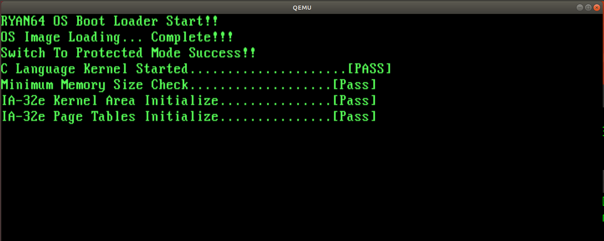

선형 주소를 실제 물리 주소로 변환
1. CR3 레지스터
    PML4 테이블의 기준 주소가 설정되어 있음.

2. 페이지 디렉터리 포인터 엔트리

3. 디렉터리 엔트리
순으로 진행하여 2MB 페이지의 기준 주소를 찾은 다음 기준 주소에 선형 주소의 하위 21비트 오프셋을 더하면 구할 수 있음.


4단계 페이징 기법을 사용하려면 세 가지 자료구조 생성 필요.
1. 페이지 맴 레벨 4 테이블(PML4 Table)
2. 페이지 디렉터리 포인터 테이블
3. 페이지 디렉터리

각 테이블은 8바이트 크기의 엔트리로 구성.


우리가 사용하고자 하는 페이징의 역할
- 선형 주소와 물리 주소를 1:1로 매핑하여 직관적인 어드레스 변환을 수행해야 함.
- 2MB 페이지를 사용하여 최대 64GB의 물리 메모리를 매핑해야 함
- 물리 메모리 전체 영역에 대해 캐시를 활성화하여 수행 속도 향상시켜야 함
- 위에서 언급한 기능 외에 다른 기능 사용 X

### 64GB의 물리 메모리 관리를 위한 메모리 계산.
우리의 OS는 2MB 크기의 페이지를 사용하여 최대 64GB의 물리 메모리를 매핑

* 64GB 물리 메모리를 매핑하는데 필요한 페이지 테이블의 개수  
= 총 66개(64게의 페이지 디렉터리 + 1개의 페이지 디렉터리 포인터 테이블 + 1개의 PML4 테이블)  
* 필요한 메모리 = 264KB   


### 페이지 테이블을 위한 공간 할당   
264KB나 되는 영역을 OS 이미지나 IA-32e 모드 커널 어드레스 공간(0x200000 ~ 0x600000)에 두는 것은 좋은 방법이 아니므로 별도의 공간을 할당할 필요가 있음.   

0x100000(1MB) ~ 0x200000(2MB) 영역을 `IA-32e 모드용 커널 자료구조 영역`으로 사용  
-> 이 공간의 가장 앞부분에 페이지 테이블이 위치.  

페이지 테이블의 순서  
1. PML4 테이블  
2. 페이지 디렉터리 포인터 테이블   
3. 페이지 디렉터리  

0x100000(1MB) ~ 0x142000(1MB + 264KB)의 어드레스에 위치


### 9.3 페이지 테이블 생성과 페이징 기능 활성화

- 페이지 테이블을 다루는데 필요한 자료구조와 매크로를 정의   
- 이를 사용해서 페이지 테이블을 생성  
- CR0 컨트롤 레지스터와 CR3 컨트롤 레지스터, CR4 컨트롤 레지스터를 제어하여 `페이징 기능` 활성화   


### 페이지 엔트리를 위한 자료구조 정의와 매크로 정의   
페이지 엔트리를 나타내는 자료구조를 먼저 정의   
세 종류의 페이지는 내부 필드가 거의 유사하므로 한 가지 형태만 정의하여 공용으로 사용.  


페이지 엔트리의 자료구조를 정의하는 코드
```
typedef struct pageTableEntryStructure{
  DWORD dwAttributeAndLowerBaseAddress;
  DWORD dwUpperBaseAddressAndEXB;
} PML4TENTRY, PDPTENTRY, PDENTRY, PTENTRY;
```


각 속성 필드에 값 정의  
8바이트 크기의 자료구조가 4바이트로 나누어 졌으므로, 이를 고려하여 각 속성에 대한 플래그를 정의  

페이지 엔트리의 속성 필드를 정의한 매크로
```
//하위 32비트 용 속성 필드
#define PAGE_FLAGS_P    0x00000001  //Present
#define PAGE_FLAGS_RW   0x00000002  //Read/Write
#define PAGE_FLAGS_US   0x00000004  //User/Supervisor(플래그 설정 시 유저 레벨)
#define PAGE_FLAGS_PWT  0x00000008  //Page Level Write-through
#define PAGE_FLAGS_PCD  0x00000010  //Page Level Cache Disable
#define PAGE_FLAGS_A    0x00000020  //Accessed
#define PAGE_FLAGS_D    0x00000040  //Dirty
#define PAGE_FLAGS_PS   0x00000080  //Page Size
#define PAGE_FLAGS_G    0x00000100  //Global
#define PAGE_FLAGS_PAT  0x00001000  //Page Attribute Table Index

//상위 32비트 용 속성 필드
#define PAGE_FLAGS_EXB  0x80000000  //Execute Disable 비트

//기타
#define PAGE_FLAGS_DEFAULT  (PAGE_FLAGS_P | PAGE_PLAGS_RW)
```


### 페이지 엔트리 생성과 페이지 테이블 생성  
PML4 테이블은 0x100000(1MB)의 어드레스에서 시작하여 4KB 영역을 차지  

페이지 디렉터리 포인터 테이블의 기준 주소는 PML4 테이블의 바로 다음에 위치하므로  
0x101000(1MB + 4KB).

속성값
- 첫 번째 엔트리의 속성값: 이전 절에서 계산한 값을 그대로 적용
- P, R/W 비트를 1로 설정.
- PML4 테이블은 첫 번째 엔트리만 유효하고 나머지 엔트리는 유효하지 않으므로 모두 0으로 설정

PML4 테이블을 생성하는 코드
```
//function which sets data on page entry.
void kSetPageEntryData(PTENTRY* pstEntry, DWORD dwUpperBaseAddress,
        DWORD dwLowerBaseAddress, DWORD dwLowerFlags, DWORD dwUpperFlags){

  pstEntry->dwAttributeAndLowerBaseAddress = dwLowerBaseAddress | dwLowerFlags;
  pstEntry->dwUpperBaseAddressAndEXB = (dwUpperBaseAddress & 0xFF) | dwUpperFlags;
}


//function which creates page table
void kInitializePageTables(void){
  PML4TENTRY* pstPML4TEntry;
  int i;

  pstPML4TEntry = (PML4TENTRY*) 0x100000;
  kSetPageEntry( &(pstPML4TEntry[0]), 0x00, 0x101000, PAGE_FLAGS_DEFAULT, 0);
  for(i=1; i<512; i++){
    kSetPageEntryData(&(pstPML4TEntry[i]), 0, 0, 0, 0);
  }
}
```


64GB 까지 매핑하는 페이지 디렉터리를 생성하는 코드
```
pstPDEntry = (PDENTRY*) 0x102000;
dwMappingAddress = 0;
//64GB 영역을 매핑하는데 필요한 페이지 디레겉리의 개수
for(i=0; i<512 * 64; i++){
  //페이지 크기인 2MB 를 1MB(20비트)로 나누어 값을 낮춘 후 루프 변수와 곱하고,
  //계산 결과를 다시 4KB(12비트)로 나누어 상위 32비트의 어드레스를 계산.
  kSetPageEntryData(&(pstEntry[i]), (i * (0x200000 >> 20)) >> 12,
                    dwMappingAddress, PAGE_FLAGS_DEFAULT | PAGE_FLAGS_PS, 0);
  dwMappingAddress += PAGE_DEFAULTSIZE; //2MB
}
```


### 프로세서의 페이징 기능 활성화

`CR0` 레지스터의 `PG`비트와 `CR3` 레지스터, `CR4` 레지스터의 `PAE` 비트만 `1`로 설정하면 페이징 기능 사용 가능.


우리의 최종 목적은 IA-32e 모드에서 동작하며 2MB 크기를 가지는 페이징을 활성화하는 것 이므로  
이를 프로세서에 알려줘야 한다.  
CR4 레지스터의 `PAE(Physical Address Extensions)` 비트와  
페이지 디렉터리 엔트리의 `PS 비트`를 1로 설정함으로써 처리 가능.   


프로세서의 페이징 기능을 활성화하는 코드
```
;set PAE bit to 1
mov eax, cr4
or eax, 0x20        ;set PAE bit(bit 5) to 1
mov cr4, eax

;activate PML4 table address and cache
mov eax, 0x100000
mov cr3, eax

;activate the paging function of the processor
mov eax, cr0
or eax, 0x80000000  ;set PG bit(bit 31) to 1
mov cr0, eax
```

프로세서의 페이징 기능을 활성하는 코드는 9장에서 사용 X   
10장에서 IA-32e 모드용 디스크립터가 생성된 후에 사용함.  
//보호 모드에서 IA-32e 모드용으로 생성된 페이지 테이블을 지정하면, 잘못된 엔트리 정보를  
//참조하므로 커널이 멈추거나 PC가 리부팅 되기 때문.


### 9.4 보호 모드 커널에 페이지 테이블 생성 기능 추가.

### 페이지 기능 관련 파일 생성

01.Kernel32/Source 디레겉리 밑에 Page.h, Page.c 파일을 추가.  
Page.c : IA-32e 모드 커널용 페이지 테이블을 생성하는 소스 파일로  
          64GB 까지 물리 주소를 선형 주소와 1:1로 매핑하는 역할을 담당

#### 페이지 테이블의 위치와 순서
PML4 테이블 -> 페이지 디렉터리 포인터 테이블 -> 페이지 디렉터리
0x100000 ~ 0x101000, 0x101000 ~ 0x102000, 0x102000 ~ 0x142000

01.Kernel32/Source/Page.h
01.Kernel32/Source/Page.c


### C 커널 엔트리 포인트 수정
C 커널 엔트리 포인트 파일은 01.Kernel32/Source 디렉터리에 있음.
Main.c를 수정.

01.Kernel32/Source/Main.c


### 빌드와 실행

</img><br/>
